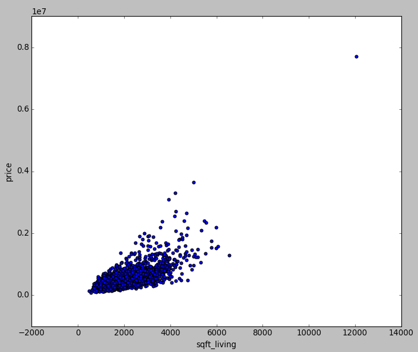
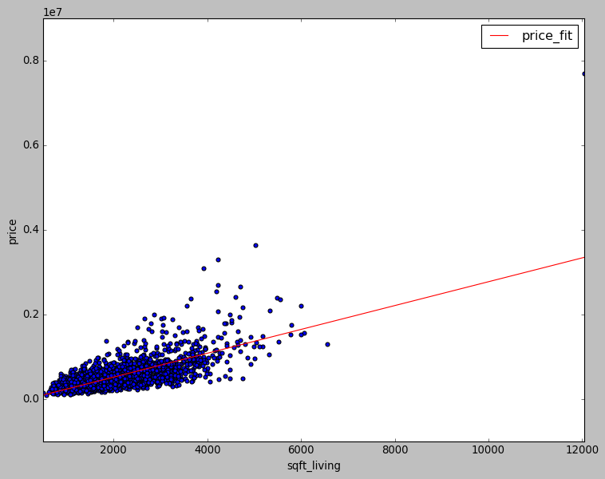

> ## Prerequisites
> There is very strong requirements on:
>
> * Python programing language (version 3)
> * Unix Shell
> 
> The following are related and will make the learning curve shallower but aren't required:
> * pandas
> * matplotlib
{: .prereq}

## Setup
In this episode we will explore housing data from Seattle Washington. The data set was originally posted on [kaggle house sales](https://www.kaggle.com/harlfoxem/housesalesprediction) but I have done some cleaning of the data (e.g. removing quotes) and we will use the cleaned data set as the starting point. 

Lets get started. First, connect to an ACENET cluster 

~~~
$ ssh glooscap.ace-net.ca
~~~
{: .bash}

and then create a folder to work in

~~~
$ mkdir ml_spark
$ cd ml_spark
~~~
{: .bash}

Now lets download the cleaned data set with
~~~
wget https://github.com/joeybernard/ACENET_Summer_School_General/raw/gh-pages/data/machine_learning/houses_clean.csv
~~~
{: .bash}
and check that it is there
~~~
$ ls
~~~
{: .bash}
~~~
houses_clean.csv
~~~
{: .output}
Lets take a look at the first bit of the data to see what it contains
~~~
$ head houses_clean.csv
~~~
{: .bash}
~~~
id,date,price,bedrooms,bathrooms,sqft_living,sqft_lot,floors,waterfront,view,condition,grade,sqft_above,sqft_basement,yr_built,yr_renovated,zipcode,lat,long,sqft_living15,sqft_lot15,
7129300520,20141013T000000,221900.0,3.0,1.0,1180.0,5650.0,1.0,0.0,0.0,3.0,7.0,1180.0,0.0,1955.0,0.0,98178.0,47.5112,-122.257,1340.0,5650.0
6414100192,20141209T000000,538000.0,3.0,2.25,2570.0,7242.0,2.0,0.0,0.0,3.0,7.0,2170.0,400.0,1951.0,1991.0,98125.0,47.721,-122.319,1690.0,7639.0
5631500400,20150225T000000,180000.0,2.0,1.0,770.0,10000.0,1.0,0.0,0.0,3.0,6.0,770.0,0.0,1933.0,0.0,98028.0,47.7379,-122.233,2720.0,8062.0
2487200875,20141209T000000,604000.0,4.0,3.0,1960.0,5000.0,1.0,0.0,0.0,5.0,7.0,1050.0,910.0,1965.0,0.0,98136.0,47.5208,-122.393,1360.0,5000.0
1954400510,20150218T000000,510000.0,3.0,2.0,1680.0,8080.0,1.0,0.0,0.0,3.0,8.0,1680.0,0.0,1987.0,0.0,98074.0,47.6168,-122.045,1800.0,7503.0
7237550310,20140512T000000,1225000.0,4.0,4.5,5420.0,101930.0,1.0,0.0,0.0,3.0,11.0,3890.0,1530.0,2001.0,0.0,98053.0,47.6561,-122.005,4760.0,101930.0
1321400060,20140627T000000,257500.0,3.0,2.25,1715.0,6819.0,2.0,0.0,0.0,3.0,7.0,1715.0,0.0,1995.0,0.0,98003.0,47.3097,-122.327,2238.0,6819.0
2008000270,20150115T000000,291850.0,3.0,1.5,1060.0,9711.0,1.0,0.0,0.0,3.0,7.0,1060.0,0.0,1963.0,0.0,98198.0,47.4095,-122.315,1650.0,9711.0
2414600126,20150415T000000,229500.0,3.0,1.0,1780.0,7470.0,1.0,0.0,0.0,3.0,7.0,1050.0,730.0,1960.0,0.0,98146.0,47.5123,-122.337,1780.0,8113.0
~~~
{: .output}

To start working with spark lets load the Spark module and dependencies. We are going to be working with a class in Spark known as a `Dataframe` which requires Spark version 2.0.0 or greater. Run

~~~
$ module purge
~~~
{: .bash}
to give us a clean slate so we are all starting from the same point, then
~~~
$ module load java/8u45 gcc python/3.4.1 spark/2.0.0
~~~
{: .bash}
to load the modules. Next we will start up the python spark shell `pyspark` by running the command

~~~
$ pyspark
~~~
{:.bash}

~~~
Python 2.6.6 (r266:84292, Aug  9 2016, 06:11:56)
[GCC 4.4.7 20120313 (Red Hat 4.4.7-17)] on linux2
Type "help", "copyright", "credits" or "license" for more information.
/usr/local/spark-2.0.0/python/pyspark/sql/context.py:477: DeprecationWarning: HiveContext is deprecated in Spark 2.0.0. Please use SparkSession.builder.enableHiveSupport().getOrCreate() instead.
  DeprecationWarning)
Using Spark's default log4j profile: org/apache/spark/log4j-defaults.properties
Setting default log level to "WARN".
To adjust logging level use sc.setLogLevel(newLevel).
17/03/29 13:24:11 WARN NativeCodeLoader: Unable to load native-hadoop library for your platform... using builtin-java classes where applicable
Welcome to
      ____              __
     / __/__  ___ _____/ /__
    _\ \/ _ \/ _ `/ __/  '_/
   /__ / .__/\_,_/_/ /_/\_\   version 2.0.0
      /_/

Using Python version 2.6.6 (r266:84292, Aug  9 2016 06:11:56)
SparkSession available as 'spark'.
>>>
~~~
{: .output}

> ## Running a script
> We are working in the pyspark shell for this episode as it works well for quickly trying things out. However it is often nicer to work with python scripts to avoid re-type many lines when mistakes are made and as a way to save the work you have done for reuse and future reference. You can run python scripts you write with spark using the `spark-submit` command passing it the path and name of your python script.
{: .callout}

## Visualizing the data

~~~
>>> import matplotlib.pyplot as plt
~~~
{: .bash}

this loads the matplotlib python module into the shell so that we can access it using the `plt` object. We will use this to show the plots we create. Next lets load the module which allows us to create a spark session and create a new spark sessions
~~~
>>> import pyspark.sql.session as pys
>>> spark = pys.SparkSession.builder.appName("House Price Prediction").getOrCreate()
~~~
{: .bash}
Now we can use the `SparkSession` object we just create `spark` to load our data into a `DataFrame`. Spark DataFrames are very similar to Pandas DataFrames, in fact you can convert a spark dataframe into a Pandas dataframe, which is what we will do to plot our data.
~~~
>>> houseSDF = spark.read.csv("file:///home/cgeroux/ml_spark/houses_clean.csv", header=True, inferSchema=True)
>>> houseSDFSmall = houseSDF.sample(False, 0.1, seed=10)
~~~
{: .bash}
Here we have read in the csv file 'houses_clean.csv' and stored the data in `houseSDF`. To get some idea of the data is like we can start by looking at the description of a column in the spark dataframe
~~~
>>> houseSDF.describe(["price"]).show()
~~~
{: .bash}
~~~
+-------+------------------+
|summary|             price|
+-------+------------------+
|  count|             21613|
|   mean| 540088.1417665294|
| stddev|367127.19648270035|
|    min|           75000.0|
|    max|         7700000.0|
+-------+------------------+
~~~
{: .output}

Then we create a sample from the total data. This smaller set will allow us to see how a subset of the data looks. If you data is very large this is important to do because in order to plot the data it will need to fit onto one machine. In this case however we are actually only using one machine and the data set isn't that large but in theory that data set could be very large and distributed across many machines. The first parameter of the `sample` function indicates if it should sample "with replacement" which means that once a particular houses data is chosen it can in theory be picked again. In our case we indicated we don't want replacement so each house chosen will correspond to a different house in the original dataset. Next we convert the spark dataframe to a pandas dataframe in order to plot it.
~~~
>>> housePDFSmall = houseSDFSmall.toPandas()
>>> housePDFSmall.plot(x="sqft_living",y="price",kind="scatter")
>>> plt.show()
~~~
{: .bash}

> ## How does the price depend on other features?
> Try plotting some of the other feature columns against the price to see how they might impact house prices.
{: .challenge}

# Modelling the data
Split the data into two groups, a training set used to build our model, and a testing set test our model with.
~~~
>>> testingSetSDF, trainingSetSDF=houseSDF.randomSplit([0.1,0.9], seed=10)
~~~
{: .bash}

Create an object which can be used to change the DataFrame data into a vector which can be used in a linear regression model.
~~~
>>> from pyspark.ml.feature import VectorAssembler
>>> vectorizer = VectorAssembler(inputCols = ["sqft_living"], outputCol = "features")
~~~
{: .bash}
Next create the linear regression model
~~~
>>> from pyspark.ml.regression import LinearRegression
>>> lr = LinearRegression(maxIter = 100, regParam = 1e-8, predictionCol = "Predicted_price", labelCol = "price")
~~~
{: .bash}
Now create a pipeline that first vectorizes our dataframe and then fits our linear regression model to the data
~~~
>>> from pyspark.ml import Pipeline
>>> lrPipeline = Pipeline(stages=[vectorizer,lr])
>>> lrModel = lrPipeline.fit(trainingSetSDF)
~~~
{: .bash}
Now we can view the linear regression model 
~~~
>>> y0=lrModel.stages[1].intercept
>>> print("intercept=",y0)
~~~
{: .bash}
~~~
-45940.53858016282
~~~
{: .output}
~~~
>>> m=lrModel.stages[1].coefficients[0]
>>> print("coefficients(slope)=",m)
~~~
{: .bash}
~~~
282.08545292501293
~~~
{: .output}
~~~
>>> maxSqft=float(housePDFSmall[["sqft_living"]].max())
>>> minSqft=float(housePDFSmall[["sqft_living"]].min())
>>> import pandas as pd
>>> lineDF=pd.DataFrame({'sqft_living':pd.Series([minSqft,maxSqft]),'price_fit':pd.Series([m*minSqft+y0,m*maxSqft+y0])})
>>> axis=housePDFSmall.plot(x="sqft_living",y="price",kind="scatter")
>>> lineDF.plot(x="sqft_living",y="price_fit",ax=axis,style='r-')
>>> plt.show()
~~~
{: .bash}

> ## How does the fit change when including more features?
> Try adding more 
{: .challenge}
## Assessing the model
Now that we have a model and visualized it we will want to be able to discriminate quantitatively between different models. One of the simplest ways to measure the quality of a linear model is the root mean square error between the model and observations. For this we will use the `testingSetSDF` created previously. Thus far all our work has been with `trainingSetSDF` used to create our model. The first step in assessing our model is to create some predictions based on `testingSetSDF`
~~~
>>> predictions = lrModel.transform(testingSetSDF).select("id","price","Predicted_price")
~~~
{: .bash}
Next we create an evaluator for our regression model and calculate the rms error
~~~
>>> from pyspark.ml.evaluation import RegressionEvaluator
>>> regEval = RegressionEvaluator(predictionCol="Predicted_price",labelCol="price",metricName="rmse")
>>> rmse = regEval.evaluate(predictions)
>>> print(rmse)
~~~
{: .bash}
~~~
238581.1949454162
~~~
{: .output}
which represents a "characteristic" error of our model. In this case it is quite large, $238,000, for comparison lets take a look at the average house price
~~~
>>> testingSetSDF.describe(["price"]).show()
~~~
{: .bash}
~~~
+-------+------------------+
|summary|             price|
+-------+------------------+
|  count|              2142|
|   mean| 522847.8590102708|
| stddev|331835.64842428756|
|    min|           82500.0|
|    max|         4489000.0|
+-------+------------------+
~~~
{: .output}
we see that it is about half the average house price.

> ## Can you get a better linear model?
> Try various combinations of features to see if you can get a lower rmse.
{: .challenge}

