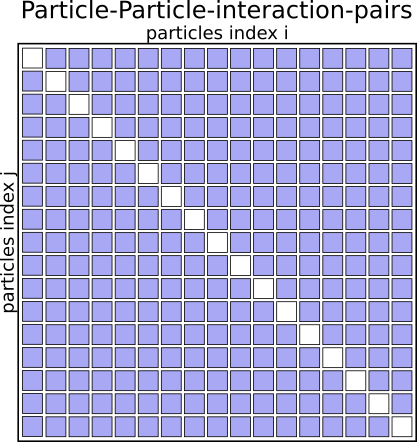
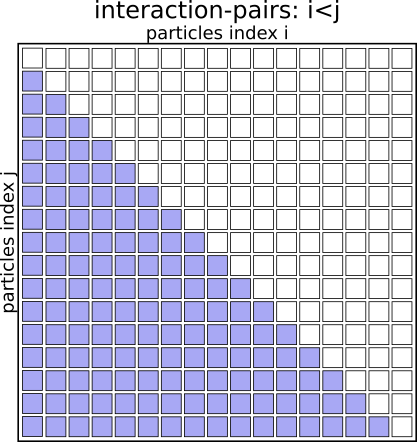
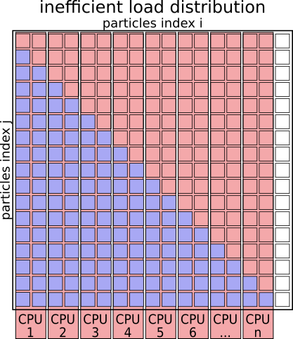

> ## Our Goals
> * Run as much as possible in parallel.
> * Keep all CPU-cores busy at all time.
> * Avoid processes/threads having to wait long for data.
{: .callout}


## What does that mean in terms of our MD algorithm?

### Serial Algorithm

The Serial MD algorithm written pseudo code looks somewhat like this:

#### Pseudo Code 
```python
initialize()
step = 0

while step < numSteps:

  for ( i = 1;  i <= nParticles; i++ ):
    for ( j = 1;  j <= nParticles; j++ ):
      if ( i != j ) :
        calculate_distance(i, j)
        calculate_potential_energy(i, j)
        # Attributing half of the total potential energy of this pair to particle J.

        calculate_force(i, j)
        # Add particle J's contribution to the force on particle I.

  calculate_kinetic_energy()
  update_velocities()
  update_coordinates()

finalize()
```
{: .code}

The algorithm basically works through a full matrix of size nParticles^2,
evaluating the distances, potential energies and forces for all pairs (i,j)
except for (i==j).

Graphically it looks like this:

#### Interaction Matrix



### Optimized Serial Algorithm

We don't need to evaluate the pairs of particles twice for (i,j) and (j,i),
as the contribution to the potential energy for both is always the same,
as is the magnitude of the force for this interaction, just the direction
will always point towards the other particle.

We can basically speed up the algorithm by a factor of 2 just by eliminating
redundant pairs and only evaluating pairs (i<j) or vice versa.

#### Pseudo Code 
```python
initialize()
step = 0

while step < numSteps:

  for ( i = 1;  i <= nParticles; i++ ):
    for ( j = 1;  j <= nParticles; j++ ):
      if ( i < j ):
        calculate_distance(i, j)
        calculate_potential_energy(i, j)
        # Attributing the full potential energy of this pair to particle J.

        calculate_force(i, j)
        # Add the force if pair (I,J) to both particles.

  calculate_kinetic_energy()
  update_velocities()
  update_coordinates()

finalize()
```
{: .code}

#### Interaction Matrix



### Simplistic parallelization of the outer FOR loop

A simplistic parallelization scheme would be to turn the outer for-loop
(over index i) into a parallel loop. How this can be done will be covered
on days two and three of the workshop.

The work could be distributed by assigning `i=1,2` to CPU&nbsp;1, `i=3,4` to 
CPU&nbsp;2, and so on. 

#### Pseudo Code 
```python
initialize()
step = 0

while step < numSteps:

  # Run this Loop in Parallel:
  for ( i = 1;  i <= nParticles; i++ ):

    for ( j = 1;  j <= nParticles; j++ ):
      if ( i < j ):
        calculate_distance(i, j)
        calculate_potential_energy(i, j)
        # Attributing the full potential energy of this pair to particle J.

        calculate_force(i, j)
        # Add the force if pair (I,J) to both particles.
  gather_forces_and_potential_energies()

  # In Serial:
  calculate_kinetic_energy()
  update_velocities()
  update_coordinates()
  communicate_new_coordinates_and_velocities()

finalize()
```
{: .code}

#### Interaction Matrix with simplistic parallelization

