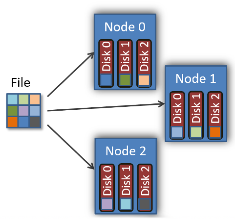
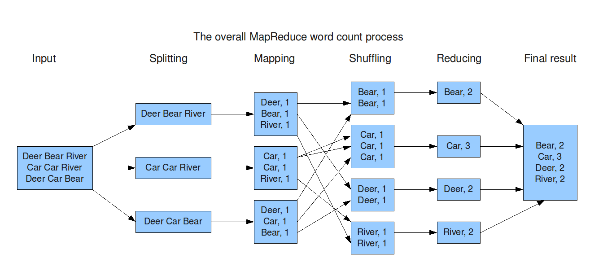
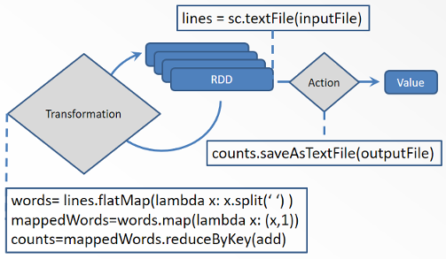

What is meant by "Big" in "Big Data"? The "Big" in "Big Data" usually is indicated by a varying number of "V" words.

* Volume: how much data you have
* Velocity: speed at which data is generated
* Variety: how varied are the data formats
* ...

while that may give some indication of features which could contribute to having "Big Data" it does not really give you a yard stick to decide if you are in the "Big Data" space or not. As a rough guide, you might want to start considering Big Data tools if your program is (or expected to) spend a large fraction of its run-time performing IO operations.

A related question could be, when should I start worrying about Big Data tools? This is some what different from the 'when is my data 'Big'' question in that there might be reasons for using Big Data tools with small data. For example the processing you wish to do on your data might be well served by the libraries and tool boxes available for Big Data even though you data is not what one would consider 'Big'.

To help guide you through all the possibilities when working with Big Data tools we will highlight two of the main tools in common Big Data software stacks **[Apache Hadoop](http://hadoop.apache.org/)** and **[Apache Spark](https://spark.apache.org/)**. Hadoop is a collection of software components which work together, **HDFS** the Hadoop Distributed File System, **MapReduce** a parallel programing framework, and **YARN** for scheduling jobs. **Spark** is a fast general programing framework for large scale data processing and can work with HDFS and YARN and is a replacement for MapReduce.

## Hadoop distributed file system

A distributed file system is a file system in which the data is distributed across a network. These file systems are often also referred to as network file systems. Often these distributed file systems attempt to make the distributed nature of the file system invisible to users so they need not worry about how the data is distributed. There are a variety of distributed file systems available.
* [Lustre](https://en.wikipedia.org/wiki/Lustre_(file_system)) is used on many HPC clusters for directories which should be available to all nodes on the cluster (e.g. user home directories)
* [Ceph](https://en.wikipedia.org/wiki/Ceph_(software)) is used on the Compute Canada cloud for virtual disks (volumes) and images.
* **[HDFS](https://en.wikipedia.org/wiki/Apache_Hadoop#Hadoop_distributed_file_system)**  (Hadoop Distributed File System) is used in Big Data environments

Many of these distributed file systems have some basic design principles in common. For example they usually have some way of spreading a file across data nodes and disks, some times referred to as **striping**. Note that distributed file systems are different from [RAID](https://en.wikipedia.org/wiki/RAID) systems in that they span computer nodes across a network rather than managing the disks within a single computer. Distributed networks can be combined with RAID systems if desired and it makes sense to do so.

IO rates are limited by how quickly you can access and modify information on a physical disk. As data size has grown this read and write speed has remained relatively constant with the exception of SSD drives which gave about a 50-100% speed up in IO performance. However, this performance increase is still substantially smaller than the growth in data size of problems in data intensive fields.

A similar issue occurred with processing power, as problem sizes grew, the speed of single CPUs was unable to keep up. This gave rise to parallel computing paradigms such as OpenMPI, OpenMP, and GPGPU where many processors work on separate subtasks in parallel which are part of the larger overall task. This reduced the time to task completion for **compute bound** problems, which are problems where the majority of the run-time is used performing computing tasks rather than IO tasks.

Conversely a task is **IO bound** if the majority of the run-time is used for performing reads and writes to disk. Some distributed file systems, including HDFS and Luster, have the ability to parallelize file IO by splitting a large file into chunks and spreading them across the compute nodes and disks. When you read from this file, instead of only have one disk reading the entire file, you have many disks simultaneously reading parts of the file thus greatly improving the IO performance. If the IO performance is not good enough, add more stripes to your file and potentially more disks.

However, this scaling up of IO performance with the addition of more disks is not quite so simple. In conventional high performance clusters (for example like the ones at ACENET) the nodes of the cluster are separated into two classes of node, **compute nodes** (which perform calculations on data) and **storage nodes** (which stores the data). These two classes of nodes are connected together via the network. This means that all the data to be read in must be transfered to compute nodes across the network. Likewise all the data written out to the storage nodes must be also transfered across the network. This means that the network and how the compute nodes and storage nodes are connected together will affect IO performance as well as the number of storage nodes and the number of disks these storage nodes have. 

This is where HDFS introduces a different approach. HDFS is designed to work in conjunction with a job scheduler to allow the job scheduler to schedule sub tasks on nodes which store the part of the data the sub tasks is to work on. This reduces the need to move data across the network to where the computations will happen and then transfer the results back across the network to the storage nodes. This can be a big win for IO bound problems. The scheduler which HDFS works with is known as **YARN** -- Yet Another Resource Negotiator. YARN schedules jobs to run on nodes where the data they work on resides.

HDFS was designed to work with cheep commodity components, this means they are expected to fail and resiliency to disk and node failure is built into HDFS. When data is written to HDFS it is replicated and stored on multiple disks and nodes. If a disk or node fails, that data is replicated to maintain a given replication factor. New nodes can easily be added to the Hadoop cluster to grow the storage and IO performance capacity of HDFS.

## MapReduce

To schedule jobs on nodes where the data resides in addition to needing a data aware scheduler (YARN) you also require a programing model which works well with splitting a task into sub tasks in such a way that they can easily be associated the data they are to work on, enter the Hadoop MapReduce programing framework.

I like to think of MapReduce as a data processing "pipeline" where you can insert your own functions into stages of this pipeline or use the defaults provided if those are sufficient for you needs. The MapReduce, pipeline has the following stages which can be customized:
1. Input reader
2. Map function
3. Shuffle
5. Reduce function
6. Output writer

Lets take the example of a word count program which counts the number of occurrences of unique words in a large text file as depicted below.

The **input reader** reads and divides the input into appropriately sized **splits** each of which are then passed to a Map function. Each split is composed of (**key**, **value**) pairs. In our word count example a key could be a line number and the value could be text of that line of the file. 

The **map function** process the (key, value) pairs generated from the reader and generates zero or more output (key, value) pairs. In the word count example this would generate a key value pair with the key being the word, and the value being a count of 1.

Between the **mapping stage** and the **reducing stage** data will be **shuffled** between nodes as needed.

The **reduce function** is then executed once for each unique key in the order sorted. In the case of the word count example the reducer function is executed once for each word (or key) and sums up all the occurrences of that word to produce the total count for that word in the document and outputs a single (key,value) pair (e.g. (word,count)). The **output writer** then writes the results to HDFS.

The map-reduce work flow works well for cases such as pattern-based searching and distributed sorting and others. However, it falls short for iterative algorithms often used in **machine learning** as it would require iterating multiple times over the map-reduce pipeline which requires reading and writing the data out at each end of the pipeline. The solution to this issue is **Spark**.

## Spark

Spark allows in-memory processing of data unlike MapReduce in that iterative operations can be performed on data sets without the requirement of writing the dataset to disk between iterations. To achieve this Spark uses as a structure called a Resilient Distributed Dataset or **RDD**. RDDs perform the same role for data in memory as HDFS does for data on disk. There is data redundancy built in so nodes can fail during a calculation and Spark can recover from it moving data and failed tasks onto existing nodes.

RDD use lazy evaluation. What this means is that you specify transforms form one RDD to another, however these transforms are not carried out until you request an action to be performed, for example writing out values from a data set.

In Spark 2.0 an additional layer of abstraction has been added over RDDs called a **Dataframe**. Dataframes make use of the [Spark SQL](http://spark.apache.org/sql/) module for processing structured data allowing SQL style queries on the Dataframes. The data in Dataframes is structured allowing further optimizations over purely RDD based implementations. Finally Spark Dataframes provide similar interfaces to dataframes in other langauges and libraries, for example  R and the Pandas library in Python. In the next episode we will use Spark to learn how to use Dataframes with [MLLib](https://spark.apache.org/mllib/) to explore what factors impact housing prices.
